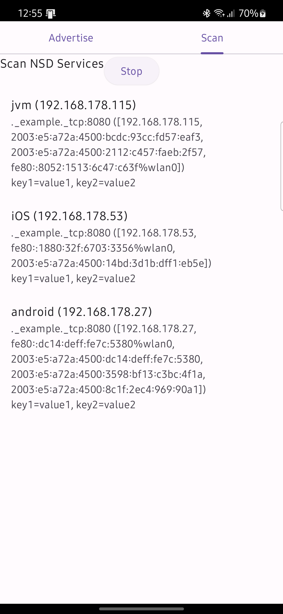
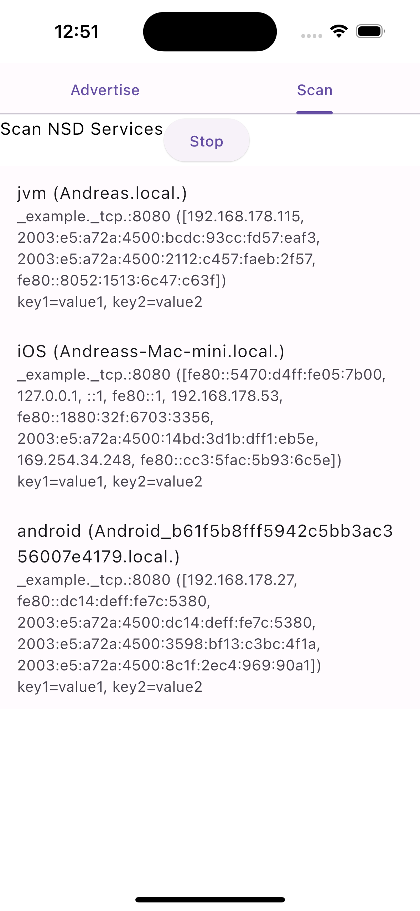
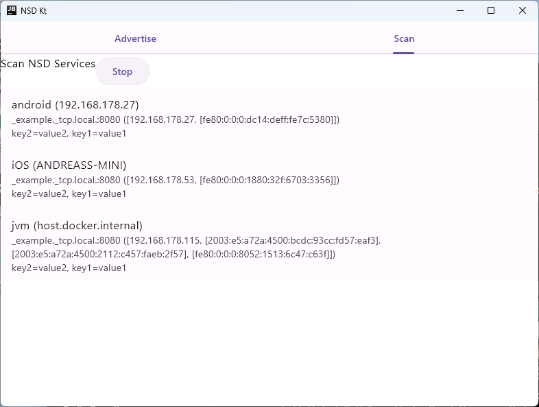

# DNS-SD Kotlin Multiplatform

[](https://central.sonatype.com/artifact/com.appstractive/dns-sd-kt)

![badge][badge-android]
![badge][badge-ios]
![badge][badge-macos]
![badge][badge-tvos]
![badge][badge-jvm]

This library implements [Multicast DNS][mdns] and [DNS-Based Service Discovery][dnssd] to provide
zero-configuration operations for Kotlin Multiplatform. It lets you announce and find services in a
.local domain.

The platform implementations are based on:

- Android: [Network Service Discovery (NSD)](https://developer.android.com/develop/connectivity/wifi/use-nsd)
- Apple: [Bonjour](https://developer.apple.com/documentation/foundation/bonjour)
- JVM: [JmDNS](https://github.com/jmdns/jmdns)

## Usage

### Installation

Gradle:

```
implementation("com.appstractive:dns-sd-kt:1.0.5")
```

### Permissions

#### Android

Add the following permissions to your manifest:

```Xml

<uses-permission android:name="android.permission.INTERNET" />
<uses-permission android:name="android.permission.CHANGE_WIFI_MULTICAST_STATE" />
```

#### Apple

Add the following permissions to your Info.plist (replace service type with your own):

```Xml

<key>NSLocalNetworkUsageDescription</key>
<string>Required to discover local network devices</string>
<key>NSBonjourServices</key>
<array>
<string>_http._tcp</string>
</array>
```

### Publish a service

Manually:
```kotlin
val service = createNetService(
  type = "_myservice._tcp",
  name = "MyService",
) {
  port = 8080
  addresses = null // platforms default addresses
  txt =
      mapOf(
          "key1" to "value1",
          "key2" to "value2",
      )
}

// start publication to network
service.register()

if(service.registered) {
    // stop publication to network
    service.unregister()
}
```

Scope based:
```kotlin
val scope = CoroutineScope(Dispatchers.Main) // or lifecycleScope/viewModelScope

scope.launch {
  publishService(
      type = "_myservice._tcp",
      name = "MyService",
  ) {
    port = 8080
    addresses = null // platforms default addresses
    txt =
        mapOf(
            "key1" to "value1",
            "key2" to "value2",
        )
  }
}

// when the scope is cancelled, the service automatically unregisters itself
scope.cancel()

```

### Discover services

```kotlin
val services: Map<String, DiscoveredService> = mutableMapOf()

discoverServices("_myservice._tcp").collect {
    when (it) {
        is DiscoveryEvent.Discovered -> {
          scannedServices[it.service.key] = it.service
          // optionally resolve ip addresses of the service
          it.resolve()
        }
        is DiscoveryEvent.Removed -> {
          scannedServices.remove(it.service.key)
        }
        is DiscoveryEvent.Resolved -> {
          scannedServices[it.service.key] = it.service
        }
    }
}
```

## Sample App

This repository contains a sample compose multiplatform application to demonstrate the usage on the
platforms Android, iOS and Desktop JVM.

| Android                                                                 | iOS                                                             | Desktop JVM                                                                 |
|-------------------------------------------------------------------------|-----------------------------------------------------------------|-----------------------------------------------------------------------------|
|  |  |  |

### Run

#### Android

```
./gradlew installDebug
```

#### iOS

Open sample/iosApp/iosApp.xcworkspace in XCode build and run

#### JVM

```
./gradlew ":sample:composeApp:run"
```

[mdns]: https://tools.ietf.org/html/rfc6762

[dnssd]: https://tools.ietf.org/html/rfc6763

[badge-android]: http://img.shields.io/badge/platform-android-6EDB8D.svg?style=flat

[badge-ios]: http://img.shields.io/badge/platform-ios-CDCDCD.svg?style=flat

[badge-macos]: http://img.shields.io/badge/platform-macos-111111.svg?style=flat

[badge-tvos]: http://img.shields.io/badge/platform-tvos-808080.svg?style=flat

[badge-jvm]: http://img.shields.io/badge/platform-jvm-CDCDCD.svg?style=flat
